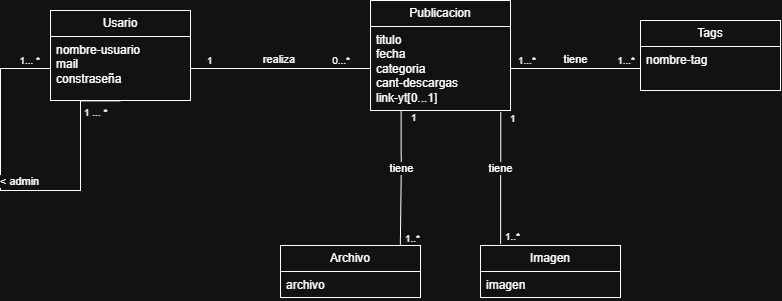

# Propuesta TP DSW

## Grupo
### Integrantes
* 51026 Albanesi, Julian Andres
* 51340 - Mendoza Sardiña, Andres Emilio

### Repositorios
* [fullstack app](https://github.com/117Andrew/tpMinecraftCompendium.git)

## Tema
### Descripción
Una pagina dedicada para construcciones decorativas y de carecter tecnico para el videojuego minecraft. Con el fin de poder compartir distintos diseños a la comudidad del videojuego, mediante archivos, imagenes y/o videos

### Modelo

## Alcance Funcional 
Regularidad:
|Req|Detalle|
|:-|:-|
|CRUD simple|1. CRUD Tag  2. CRUD Usuario|
|CRUD dependiente|1. CRUD seguimiento {depende de} CRUD Usuario  |
|Listado + detalle| 1. Listado de publicaciones filtrado por tag|
|CUU/Epic|1. Crear publicacion|

Adicionales para aprobación
|Req|Detalle|
|:-|:-|
|CRUD |1. CRUD Publicacion  2. CRUD Adjuntos  3. CRUD Comentarios|
|CUU/Epic|1. Crear publicacion con adjuntos  2. Moderear comentarios con IA|

### Alcance adicional voluntario
|Req|Detalle|
|:-|:-|
|Listados|1. Listado de publicacion de usarios seguidos|
|CUU/Epic| 1. Moderar contenido con IA   2. Moderacion de imagenes con IA|
|Otros|1. Nivel de usario por cantidad de descargas totales|
